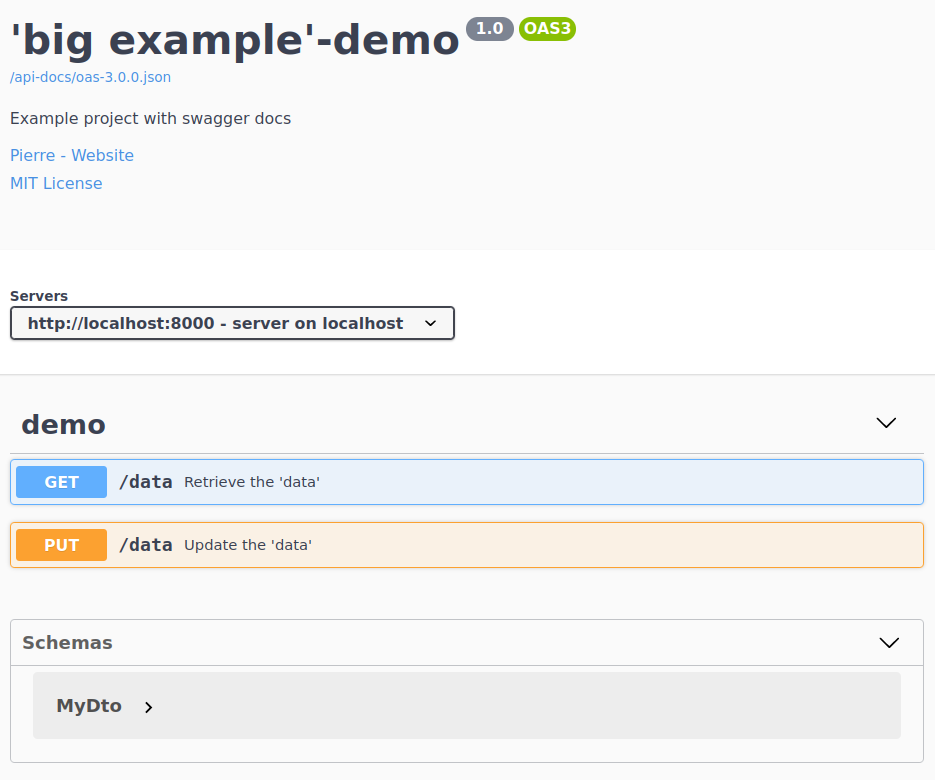

# big_example

A playground to play with different technologies and libs...

## cpp_openapi_with_oat: C++ Service

   * src: main code
   * test: unittests
   * oat_test: oat++ unittests
   * `sh build.sh` (then start ./App in build folder)

## api-spec: extracted openapi spec 
(manually from running C++ application/swagger UI)

After building the SW, you can run ./App and open http://localhost:8000 
(here you find a link to the spec.):

## ts_from_cpp_openapi: Typescript test for C++ Service
   * `npm i`
   * `npm test`
   * (to update code if a new api-spec is extracted: `npm run update-lib`)

## py_manual_request
   * `py.test` (pytest and requests are installed in the docker)

## py_from_cpp_openapi: Typescript test for C++ Service
   * (to update code from running ./App: `./update-api`)
   * `cd big-example-demo-client`
   * `py.test`
